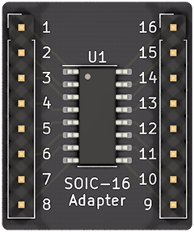
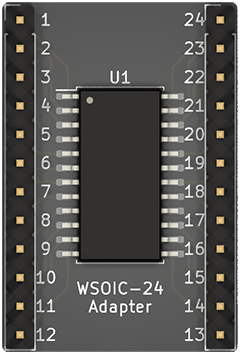

# Adapter Boards
A collection of breadboard-friendly adapter boards for easy prototyping with SMD components. All project files are created with KiCad 6 and are not backwards compatible. Gerber outputs for each board are zipped in their respective folders.

| Board Image | Description |
|---|---|
|   | **SOIC 3.9mm Footprint - up to 16 pins**  |
| | **WSOIC 7.5mm Footprint - up to 24 pins** |
